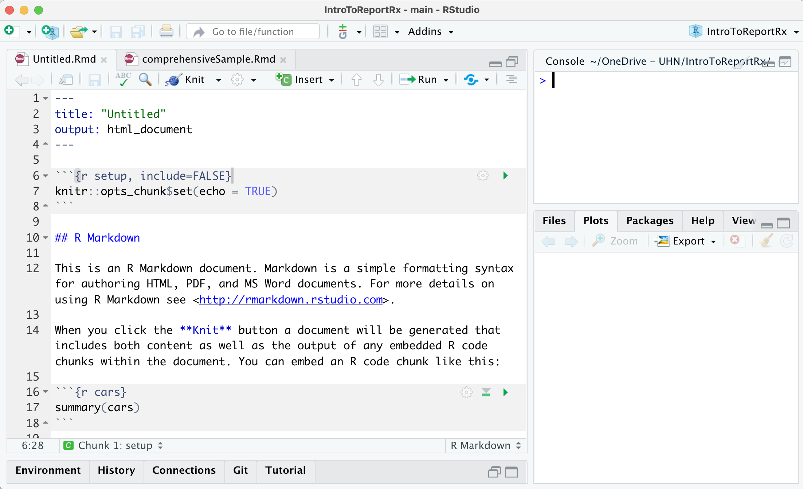
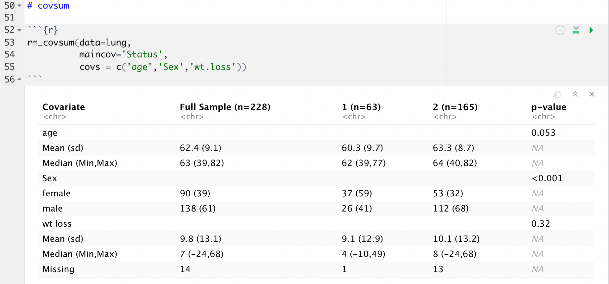
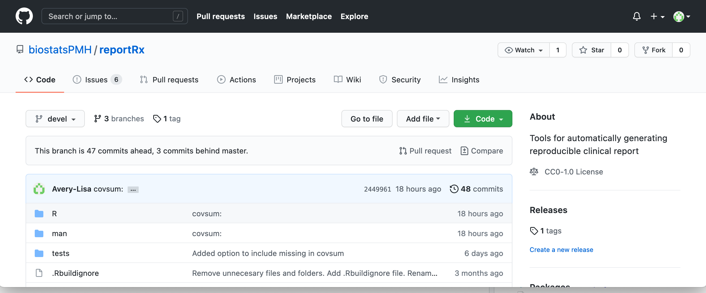

---
title: "reportRx & R Markdown"
author: "Princess Margaret Biostatistics"
date: "`r Sys.Date()`"
rmd_files: ["index.Rmd"]
bibliography:
  - bibfile.bib
csl: Vancouver.csl
site: bookdown::bookdown_site
output:
  bookdown::gitbook: 
    split_by: 'section'
    pandoc_args: [ "--csl", "Vancouver.csl" ]
    config:
      toc:
        toc_depth: 3
        collapse: none
        scroll_highlight: yes
        before: |
          <li> &nbsp;&nbsp; reportRx    </li>
          <li> &nbsp;&nbsp; PMH Biostatistics</li>
        after: |
          <li> <a href="mailto:lisa.avery@uhnresearch.ca">Lisa Avery</a>   </li>
        toolbar:
        position: fixed
      edit : null
      download: null
      search: yes
      sharing:
        facebook: false
        twitter: false
        all: false
      fontsettings:
        theme: white
        family: sans
        size: 2
      info: no
documentclass: krantz
link-citations: yes
colorlinks: yes
graphics: yes
lot: yes
lof: yes
fontsize: 11pt
monofont: "Source Code Pro"
monofontoptions: "Scale=0.8"
---

```{r  include=FALSE}
knitr::opts_chunk$set(echo = TRUE)
library(emo)
library(reportRx)
#rmdBibfile("../sanitised-library.bib","bibfile.bib")
```


# Introduction

**R Markdown** is an alternative to R Sweave for literate programming and reproducible research. It can output to html, Word and PDF.

**reportRx** is a package to facilitate and standardise the presentation of common statistical analyses. 

There are three basic types of functions:

- tabular reporting functions (`covsum`,`uvsum`,`mvvsum`,`ordsum`)
- wrappers for printing in Sweave (`pcovsum`,`puvsum`,`pmvsum`) 
- wrappers for printing in RMarkdown (`rm_covsum`,`rm_uvsum`,`rm_mvsum`)
- plotting functions (`ggsurv`,`plotunivariate`,`forestplot`,`riskplot`)

R Markdown + reportRx  = More time on stats and less time on formatting `r emo::ji("smile")` 


<a href="images/reportRxRMarkdownDemo.Rmd" target="_blank">A demo RMarkdown document show casing the reportRx functions is available here.</a> 


# R Markdown 

R Markdown is a package designed for literate R programming and is part of the [RStudio IDE](https://www.rstudio.com/products/rstudio/download/).

Like Sweave documents, R Markdown documents contain both text and R code. 

R Markdown documents contain three main parts:

1. The YAML header, which is akin to the header in a Latex document. 
2. Code chunks, just like Sweave.
3. Text, just like Sweave, but written in markdown, not Latex.



There are excellent [tutorials](https://rmarkdown.rstudio.com/lesson-1.html) available for learning R Markdown.

## From R Markdown to PDF/Word/HTML

With reportRx + Sweave .Rnw documents are first made into pdf documents, and then converted to Word documents.

With R Markdown, an .Rmd document is converted to .md and then to PDF, HTML or WORD:


## Why Use R Markdown instead of Sweave?

- No need to learn Latex!
- Formatting is a little quicker: `# Section Header` instead of `\section{Section Header}`
- Easily output to multiple formats, quickly tweak a pdf report to make slides
- Lots of development work is being done to support document creation in R Markdown:
  * Journal Articles & Handouts https://blog.rstudio.com/2016/03/21/r-markdown-custom-formats/
  * Xaringan Presentations https://slides.yihui.org/xaringan/#1 
  * Teaching Materials with GitBook https://cjvanlissa.github.io/gitbook-demo/
  * Websites with Blogdown https://alison.rbind.io/post/new-year-new-blogdown/

`r emo::ji("right")`  If you know Sweave, picking up Markdown is easy!


## YAML Header

The top of an R Markdown document is called the YAML header (yet another markup language).

```yaml
---
title: "Untitled"
author: "Your Name Here"
date: "`r format(Sys.time(), '%d %B, %Y')`"
output:
  pdf_document:
    latex_engine: xelatex
  word_document:
    fig_height: 5
    fig_width: 7
---
```
 
This is where you can specify:

- Title
- Author
- Date
- theme (html) or reference style document (Word)
- Table of Contents options
- figure default heights & widths
- bibliography/csl files
- ... and lots of other things

Having your own *.Rmd template file with the options you most often use is helpful.

A simple example is available <!--[here](simpleYAML.Rmd)--> <a href="images/simpleYAML.Rmd" target="_blank">here</a> and a more comprehensive example is <!--[here](comprehensiveYAML.Rmd)--> <a href="images/comprehensiveYAML.Rmd" target="_blank">here</a>

The [ymlthis package](https://cran.microsoft.com/web/packages/ymlthis/ymlthis.pdf) can help you to write more complicated YAML headers.

## Code Chunks

Like Sweave, R Markdown has code chunks and the options are very similar. In R Markdown, chunk options can be set globally in the `setup` chunk. These options are over-ridden by any locally set options.


For example, to hide the code and suppress warnings and messages **in the output** you can set the options like this:

  ```{r setup}
  knitr::opts_chunk$set(echo = FALSE,warning=FALSE,message = FALSE)
  library(reportRx)
  ``` 

Useful chunk options:

- `eval = FALSE` prevents evaluation of the code. This can be useful for chunks of code that take a long time to run and you may want to run once and save to an R file. It replaces the need to source a separate R script for some code.

- `echo = FALSE` hides the code, but prints any output.

- `warning = FALSE` and `message = FALSE` suppress warnings
  and messages.

- `results = "hide"` hides the output (can be used with echo=TRUE).

- `results = "asis"` treats the output of your R code as literal Markdown.
    This is useful if you want to generate text from your R code, for example using `cat`.
  
- `fig.width = 5` and `fig.height = 5` set the height and width of figures
  (in inches).

- `fig.cap ='A nice caption'` will print a caption beneath a figure.

For other options see <https://yihui.name/knitr/options>. 


## Running Chunks

You can run section of code with Cmd/Ctrl + Shift + Enter, like Sweave, or execute all the code with the green arrow at the top-right corner of the chunk.

Unlike Sweave, by default code chucks are executed inline, so that you see the output immediately beneath the code chuck, like this:



If you prefer to have the output sent to the Console and the Plots pane instead, then you can you can change this option.

In the RStudio menu:
  Tools > Global Options > R Markdown > Show output inline for all R Markdown Documents.  **Uncheck This**
  
## Formatting

R Markdown is designed for quick markup. Inserting page breaks, sections, sub-sections, figures, tables and images is very easy.

Formatting is very simple. More extensive formatting is possible and described [here](https://bookdown.org/yihui/bookdown/customization.html).

These are the basic formatting options that will work with any output format:

- `_italic_` or `*italic*` for _italic_
- `__bold__` or `**bold**` for **bold**    
- `<!--  Text Comments -->` for comments that won't appear in the output
- `[PMH Biostatistics](https://www.biostatspm.com/about-us)` for hyperlinks [PMH Biostatistics](https://www.biostatspm.com/about-us) 
- `` for images 

## Sections & Breaks

- `# Section Header` will start a new section. The space after the `#` is important.
- `## Subsection Header` for subsections, `### subsubsection` and so on. 
- `## unnumbered subsection {-}` add ` {-}` for unnumbered headings
- Control how many sections in the table of contents (if you want a TOC) in the yaml header:
  ``` yaml
  output:
  word_document:
    toc: yes
    toc_depth: 3
  ```

Pagebreaks (in Word/PDF) can be created with the `\newpage` command.

Horizontal lines can be created with three hyphens (`---`) on a separate line. 

---

## Lists

Create ordered or unordered lists easily. Note that there must be an empty line before the list.

```
* Unordered list
* Item 2
    * Nested bullets need a 4-space indent.
    * Item 2b
```

```
1. Ordered list
1. Use `1` for each item and they will be numbered automatically in the output.
1. Handy for when you need to add something in the middle!
```

## Figures and Tables

Plots created in code chucks will be produced in the output, as will Tables formatted by reportRx.

Images not created by R can be inserted with this code: ``

If you need a table where the data **is not** in a R you can use this (colons determine alignment):

```
| Right | Left | Default | Center |
|------:|:-----|---------|:------:|
|   12  |  12  |    12   |    12  |
|  123  |  123 |   123   |   123  |
|    1  |    1 |     1   |     1  |
```

... but that is a pain, better to have the data in R and use reportRx.

## Formulas

Regular Latex-style formulas can be easily written in R markdown. Use single `$` for inline expressions and `$$` for enclosing standalone expressions.


Examples: 

$\beta_0 = 1.0$` for embedded inline formulas like this $\beta_0 = 1.0$
  
```
$$OR = \frac{Odds_{cases}}{Odds_{controls}}$$
```

$$OR = \frac{Odds_{cases}}{Odds_{controls}}$$

More details and examples of how to write matrices are [available here](https://bookdown.org/yihui/rmarkdown/markdown-syntax.html#math-expressions).

<!--
## Using Latex
R Markdown is designed to be quicker and easier than Latex and to enable output to multiple formats from a single source document.  You can use Latex code in R Markdown, but a lot of it may not work if you are outputting to a Word Document.  [More details on Latex in R Markdown are available here.](https://bookdown.org/yihui/rmarkdown-cookbook/latex-output.html)

Command you can use in R Markdown to output to pdf and Word:

-  `\newpage` to create a pagebreak (if you are running an up to date version of knitr)
-->


## References

In addition to the regular `word_document` and `pdf_document` output types there is a very popular package called `bookdown` that has word and pdf output formats that enable easier cross-referencing. ReportRx will produce tables that are properly formatted in all output formats. You can learn more about bookdown [here](https://bookdown.org/yihui/bookdown/)

To reference a figure, the chunk needs a name, and for fig.caption to be set and can be referenced using `\@ref(fig:speed-plot)` where `speed-plot` is the name of the chunk containing the figure. 
Example: Figure \@ref(fig:speed-plot2) is an example of a boxplot. 
  
  ```
  {r speed-plot,fig.cap='Speed and distance.',fig.height=2.5}
  data(cars)
  plot(x=cars$dist,y=cars$speed)
  ```

```{r speed-plot2,fig.cap='Speed and distance.',fig.height=2.5}
data(cars)
plot(x=cars$dist,y=cars$speed)
```

To reference tables is a similar, use `\@ref(tab:speed-tab)`. If outputting to Word,  `chunk_label` needs to be specified as an argument. For HTML/PDF this can be omitted. Hopefully this will be automated for Word one day.

Example: Tab \@ref(tab:speed-tab2) is an example of a table. 

  ```
  {r speed-tab}
  rm_covsum(data=cars,covs = c('speed','dist'),
            chunk_label = 'speed-tab')
  
  
  ```

```{r speed-tab2}
rm_covsum(data=cars,covs = c('speed','dist'),
          chunk_label = 'speed-tab')

```


## Citations 
To add citations use  `[@bibindex]`. For example `[@Ensor2014]` will produce a citation in the document like this: [@Ensor2014], and will be added to the bibliography with the following entry:

<div id="refs"></div>` 

R packages can be referenced like this: `[@R-reportRx]` and R like this: `[@R-base]`. To cite more than one article or package separate them with semicolons: `[@R-base;@R-reportRx]`.

## Creating a bibliography

For R Markdown to create the bibliography, a bibliography file (in the biblatex format) needs to be specified in the YAML. Optionally, a csl file can also be specified. Note that if no filepath is specified, then the directory of the .Rmd file is used. In this example, bibfile.bib is in the local directory, but the csl is stored in a central location.

  ```yaml
  bibliography:  bibfile.bib
  csl: ../../../csl/Vancouver.csl
  ```

There is now a reportRx function, `rmdBibfile` that will read through an R Markdown document and extract all the references from a master bibfile and write them to a local file along with and all the R packages referenced in the document.

`reportRx::rmdBibfile('../library.bib','bibfile.bib')` will use the file library.bib in the parent directory to extract references from and write a smaller bib file in the local directory stored as bibfile.bib with all the references in the current document, including R packages.


The master bibfile can be the .bib file produced by programs like Mendeley or Zotero. 


## Moving References

By default, references are at the end of the document which can be annoying if you would like to put them before an Appendix.

Use this command to place the references (this works for all output types).

```
# References
<div id="refs"></div>` 
```

# reportRx 

reportRx has reporting functions, printing functions and plotting functions. The actual reporting functions are not called directly, but are called by the printing functions. 

Reporting Functions:

  * [covsum]  Used to produced Table 1 style output
  * [etsum] To summarise output from a coxph model
  * [uvsum] To combine several univariate models into a single table
  * [ordsum]  Like `uvsum` for ordinal output. May be added into uvsum one day
  * [mvsum]  To summarise multivariable model output
    
Printing functions for **Sweave** use the prefix `p` (ie. `pcovsum()`). 

Printing functions for **R Markdown** use the prefix `rm_` (ie `rm_mvsum()`).


## lung data

The sample code will use data from the `lung` dataset in the `survival` package. To run the code samples shown here requires that the lung data be loaded and mutated as follows:

  ```
  library(tidyverse)
  library(survival)
  library(reportRx)
  data(lung)
  lung <- lung %>%
    mutate(
      Status=factor(status-1),
      Sex = as.character(factor(sex,labels = c('Male','Female'))),
      sex = factor(sex),
      OneLevelFactor = factor(x='one level')
    ) 
  
  lung$Sex[sample(1:nrow(lung),size=10)] <- NA
  ```

```{r}
library(tidyverse)
library(survival)
library(reportRx)
data(lung)
lung <- lung %>%
  mutate(
    Status=factor(status-1),
    Sex = as.character(factor(sex,labels = c('Male','Female'))),
    sex = factor(sex),
    OneLevelFactor = factor(x='one level')
  ) 
# randomly remove some Sex values
lung$Sex[sample(1:nrow(lung),size=10)] <- NA
```

## covsum 

`covsum` can be used to generate Table 1 style output for either the entire sample, or by specifying the `maincov` argument, by subgroups. Note the use of `rm_covsum`.

Typing `?covsum` will provide a complete description of the covsum arguments. Here the most recent changes are highlighted.


  ```
  rm_covsum(data=lung,
         covs=c('Status','wt.loss','OneLevelFactor'),
         digits=2,
         maincov = 'Sex',
         all.stats=TRUE,
         include_missing=T,
         percentage='row', 
         pvalue=FALSE)
  
  ```

```{r}
rm_covsum(data=lung,
       covs=c('Status','wt.loss','OneLevelFactor'),
       digits=2,
       maincov = 'Sex',
       all.stats=TRUE,
       include_missing=T,
       percentage='row', 
       pvalue=FALSE)

```

**New Functionality & Bug Fixes**

- `digits` number of digits for summarizing numeric data
- `pvalue` boolean indicating if you want p-values included in the table
- `full` boolean indicating if the full sample column should be displayed
- `include_missing` prints the number of values of the maincov missing and excluded from the table
- `percentage` choice of how percentages are presented ,one of *column* (default) or *row*
- `show.tests` option to display the statistical tests performed
- `all.tests` option of showing both the IQR and the range on separate lines 
- `excludeLevels` option to exclude levels from covariates from association tests 
- Added functionality to test for small counts in contingency table and perform Fisher.exact if req'd
- If testcont=T will perform unequal variance t-test for two groups
- character variables are automatically converted to factors
- function will now work with data imported from SPSS using `haven` package
- function works as expected with factors containing only a single level
- if median, Q1,Q3 (or Min/Max) are all integers decimals are not reported
- NaN is no longer displayed, instead cells are empty
- silenced the try function 


## uvsum

`uvsum` will produce a single table with many univariate results


  ```
  rm_uvsum(response = 'Status',
        covs=c('wt.loss','Sex','ph.ecog','meal.cal','age'),
        data=lung,
        CIwidth=.9)
  ```

```{r}
rm_uvsum(response = 'Status',
      covs=c('wt.loss','Sex','ph.ecog','meal.cal','age'),
      data=lung,
      CIwidth=.9)
```

**New Functionality & Bug Fixes**
  
- **showN** is an option to show the sample size for each variable/factor level
- **CIwidth** allows for differ confidence intervals to be produced
- output
- proper t-distribution confidence intervals for means are produced
- function will check for variables and produce useful warnings
- character variables are automatically converted to factors
- function will now work with data imported from SPSS using `haven` package

## mvsum

`mvsum` will return a consistently formatted table for different types of mutivariable models

  ```
  glm_fit = glm(Status~Sex+age+wt.loss,data=lung,family = 'binomial')
  rm_mvsum(glm_fit)
  ```

```{r}
glm_fit = glm(Status~Sex+age+wt.loss,data=lung,family = 'binomial')
rm_mvsum(glm_fit)
```

**New Functionality & Bug Fixes**

- **showN** is an option to show the sample size for each variable/factor level
- **CIwidth** allows for differ confidence intervals to be produced
- automatically retrieve data from the model if not specified
- fixed bug with variable names embedded in level names
- fixed bug with centering in models
- added support for polr ordinal regression models
- updated CIs to use t-test instead of Z-test for means
- fixed treatment of glm objects to properly handle linear, binomial and poisson models

## ggsurv

... this function has been replaced by `ggkmcif` and may be deprecated. 


## ggkmcif

Plot KM and CI curves using ggplot2 with the usual reportRx arguments and a lot of options for customisation for publication-ready plots.

  ```
  ggkmcif(c("time","status"),"Sex", data=lung,fsize=10,nsize=4)

  ```

```{r}
ggkmcif(c("time","status"),"Sex", data=lung,fsize=10,nsize=4)
```


## plot_univariate

Designed to be a visualisation of `uvsum` with arguments supplied in the same manner. This goal is not publication-ready plots but rather a quick means of displaying the data to facilitate the interpretation of the `uvsum` output from.  


  ```
  plot_univariate(response = 'Status',
        covs=c('Sex','ph.ecog','meal.cal','age'),
        data=lung)
  ```

```{r}
plot_univariate(response = 'Status',
      covs=c('Sex','ph.ecog','meal.cal','age'),
      data=lung)
```


## forestplot2

This will produce a forest plot of OR or RR from an object derived from glm. The risks are plotted on a log-scale, ordered from highest to lowest.

  ```
  fit = glm(Status~age+Sex+wt.loss+ph.karno+ph.ecog+pat.karno+meal.cal,
            family='binomial',
            data=lung)
  forestplot2(fit, rmRef=T)
  
  ```

```{r}
fit = glm(Status~age+Sex+wt.loss+ph.karno+ph.ecog+pat.karno+meal.cal,
          family='binomial',
          data=lung)
forestplot2(fit, rmRef=T)

```

(**Note:** There is an existing forestplot function, which is why this one is named forestplot2)

## etsum

Automatically output text from survival analysis. Set the code chuck option `results='asis'`.

!**Note:** This function may have bugs. Please let us know if you have trouble.

  ```
  rm_etsum(data = lung, response = c("time","Status"), group = 1,
         times=c(365,720,1095), units="days")
  
  ```

Will output this :

```{r, results='asis'}
rm_etsum(data = lung, response = c("time","Status"), group = 1,
       times=c(365,720,1095), units="days")

```

## outTable

This function will output a simple table nicely in any of the main R Markdown output formats, including bookdown. 

Arguments:

- `to_indent` row indices specifying a small indent in the first column
- `to_bold` row indices specifying which rows to bold
- `caption` a caption to print above the table.

  ```
  library(janitor)
  tab <- lung %>% tabyl(Status,Sex)
  outTable(tab, 
           to_indent=1,
           to_bold=2,
           caption= 'Status by Sex in the Lung data' )
  ```

```{r}
library(janitor)
tab <- lung %>% tabyl(Status,Sex)
outTable(tab, 
         to_indent=1,
         to_bold=2,
         caption= 'Status by Sex in the Lung data' )
```

## excelCol

Retrieve the column numbers corresponding to Excel column headers. This can be useful if variables are referred to by Excel column names in the statistical analysis plan.

Example: 

  ```
  excelCol(A,B,BG,CC)
  ```

Returns:

```{r,comment=''}
excelCol(A,B,BG,CC)
```

# Github

(reportRx)[https://github.com/biostatsPMH/reportRx] and (this documentation)[https://github.com/biostatsPMH/IntroToReportRx] are available on the PMH Biostats Github page, along with Jessica's (swimmplot package)[https://github.com/biostatsPMH/swimplot].

Anyone can copy or download code from the git repository, without fear of deleting anything.



## Help us Improve

If you find a bug or would like to request a new feature you can [log an issue](https://github.com/biostatsPMH/reportRx/issues)


## Github Account

If you don't already have a github account you will need to set one up to [log issues](https://github.com/biostatsPMH/reportRx/issues) or [access the code](https://github.com/biostatsPMH/reportRx/tree/devel).

Please log issues using your **uhnresearch email** (and your real name!). This will help us to prioritise issues arising from within the department.

